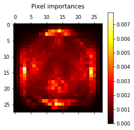

# Classification Modeling

[Jupyter Notebook](http://nbviewer.jupyter.org/github/nolanadams1230/Doodle_Classification/blob/master/notebooks/Classification%20Models%20-%20Doodles.ipynb)

[Github](https://github.com/nolanadams1230/Doodle_Classification/blob/master/notebooks/Classification%20Models%20-%20Doodles.ipynb)

By simply randomly guessing, one should be able to reach ~10% accuracy (since there are only ten class labels). A machine learning algorithm will need to obtain > 10% accuracy in order to demonstrate that it has in fact “learned” something (or found an underlying pattern in the data).

For all the models, except the Convolutional Neural Network and the Transfer Learning model (VGG16), we used GridSearchCV to tune the most important hyper-parameters.

## K-Nearest Neighbors

To start, I modeled the data with the k-Nearest Neighbor (k-NN) classifier, which is arguably the most simple, easy to understand machine learning algorithm. The k-NN algorithm classifies unknown data points by finding the most common class among the k-closest examples. Each data point in the k closest examples casts a vote and the category with the most votes is chosen.

Using GridsearchCV and the elbow-method to tune the *k-neighbors* parameter we found that 3 neighbors seems like the best choice to avoid overfitting. The main advantage of the KNN algorithm is that it performs well with multi-modal classes because the basis of its decision is based on a small neighborhood of similar objects. This is why its results were fairly high with 80%. The main disadvantage is the computational cost are very high and the results take far too long. Also this classifier would not be ideal if we wanted to make predictions on the fly, since k-NN classifier trains the data fast but then makes predictions very slow.

Our final result for KNN was **0.8037**. This is a good baseline to compare the other models.

## Random Forest
Random forests is an ensemble model which means that it uses the results from many different models to calculate a label. For our model we tuned *n_estimators* which is the number of trees you built before taking the maximum voting or averages of predictions. Higher number of trees give you better performance but makes your code slower. Using the elbow method again, show us **80 estimators** was a good choice since the number of estimators above 80 did not improve the model enough to be worth the extra computational requirements.

We then tuned the *max_features* parameters, which are the maximum number of features Random Forest is allowed to try in individual tree. By limiting the max features to the **square root of total features** we improved the model and made it computationally less expensive.

We then plotted the pixel importances and saw that the edges of the doodles tend to be the most important.

Our final results for the Random Forest Classifier was **0.8048.** The random forest had an accuracy score very close to the k-nn model. 

## Support Vector Machine
SVM classification uses planes in space to divide data points. We will created two models with different types of dividing planes (Linear and Non-Linear)

The linear model (LinearSVC) had an accuracy of **0.7178**, while the non-linear model (SVC with Radial Basis Function) had an accuracy of **0.7815**. While the non-linear model was better, both of these did not outperform either the k-NN model or the Random Forest model.

## Multi-Layer Perceptron
A perceptron is a neural network with a very basic architecture. This will be good to compare against the convolutional neural network. Neural Networks receive an input (a single vector), and transform it through a series of hidden layers. Each hidden layer is made up of a set of neurons, where each neuron is fully connected to all neurons in the previous layer, and where neurons in a single layer function completely independently and do not share any connections. The last fully-connected layer is called the “output layer” and in classification settings it represents the class scores.

For tuning the hyper-parameters for a Multi-Layer Perceptron, we tried different number of layers (1-3 hidden layers) and number of neurons in each layer (100 vs 758). The default activiation function (ReLu) is the most effective choice from sklearn and the the defualt optimization algorithm (adam) is the best choice due to the size of our dataset. The best model was the one layer model with 758 neurons.

The Multi-Layer Perceptron has an accuracy of **0.8299**, which so far is the best model.

## Convolutional Neural Networks (CNN / ConvNet)
The Convolutional Neural Network architectures make the explicit assumption that the inputs are images, which allows us to encode certain properties into the architecture. These then make the forward function more efficient to implement and vastly reduce the amount of parameters in the network.

